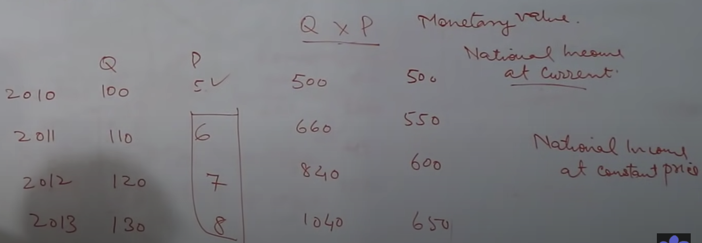

# National Income - GDP/GNP/NNP/NDP

1. **Gross Domestic Product**
* Monetary Value of all final goods & services produced in an economy in an accounting year
  * Monetary value = Q*P
  * Final good -> to avoid double accounting, not intermediary goods
  * Economy -> National Geographical boundary
  * National Income is a flow variable
    * Measured in time period - accounting year
    * While stop variable can be measured at a point
    * Ex - Income earned by a person is flow variable

2. **Gross National Product**
* GNP = GDP +- Net factor income earned from abroad
  * Add income of Indian people working abroad (Inflow)
  * Minus income of Foreigners working in India (Outflow)

3. **Net Domestic Product** = GDP - Depreciation
4. **Net National Product** = GNP - Depreciation
 

**Real Output Growth** -> When NI taken at constant price 
  * Exclusing the effect of price
  * NI is calculated both at **constant price** and **current price**
  
    

**GNP at market price = GNP at factor cost + Indirect Taxes - Subsidy**

> Note : If only NI is mentioned in question, it is NNP at factor cost (may be at const or current)

**Per Capita Income = National Income / # Of People = Y/N**

**Personal Income** -> The income which is going in the pocket of individuals
* For this we need to minus depreciation, taxes, etc from NI
* **Personal Disposable Income** -> Removing income taxes from PI 
  * Income available to individuals to spend